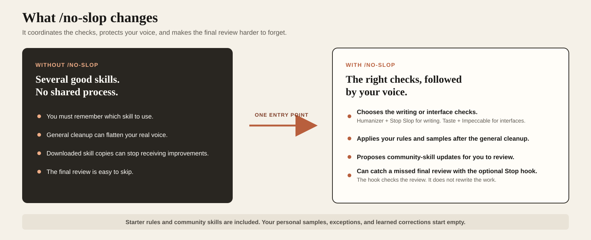
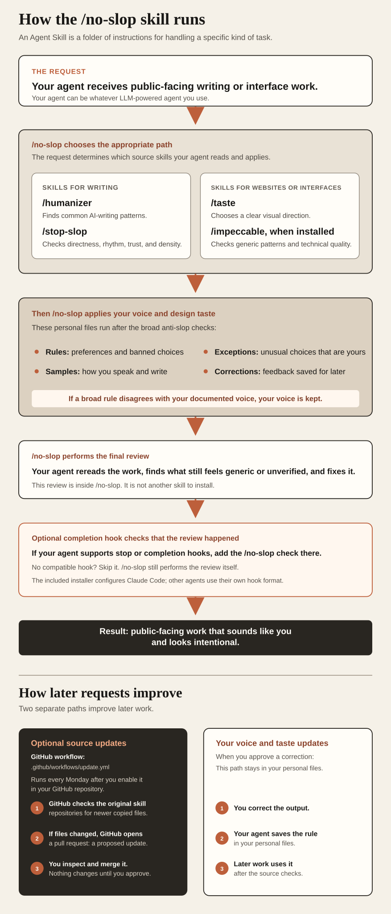

# Anti-Slop Skills Consolidated, Routed, and Updated in One Skill: /no-slop

/no-slop is an Agent Skill that coordinates
[Humanizer](https://github.com/blader/humanizer),
[Stop Slop](https://github.com/hardikpandya/stop-slop),
[Taste Skill](https://github.com/leonxlnx/taste-skill), and
[Impeccable](https://github.com/pbakaus/impeccable) when it is installed
separately. It chooses the appropriate path, runs the skills in a deliberate
order, applies your own rules and examples, and performs a final review before
the work is finished.

Here, **your agent** means whatever LLM-powered agent you use. The core
`SKILL.md` is designed to work in agents that support Agent Skills or Markdown
instruction folders. Installation, automatic loading, and hooks still depend
on the agent. The included Stop hook installer currently supports Claude Code.

The system can keep improving through source updates and approved personal
feedback. The updater can check the original GitHub repositories for changes
to the included community skills and propose those changes for review.
Approved feedback can be saved to your personal `voice/` files and used on
later work. Source updates keep the included community skills current. Saved
feedback stops you from having to repeat the same correction.



- **Writing:** [/humanizer](https://github.com/blader/humanizer) ->
  [/stop-slop](https://github.com/hardikpandya/stop-slop) -> your voice -> final
  review
- **Interface:** [/taste](https://github.com/leonxlnx/taste-skill) ->
  [/impeccable](https://github.com/pbakaus/impeccable), when installed -> your
  design taste -> final review

The goal is public-facing work that sounds and looks intentional while keeping
your documented voice in control of the result.

## How it works

No Slop runs this sequence:

1. **Broad anti-slop checks.** Writing uses
   [Humanizer](https://github.com/blader/humanizer) and
   [Stop Slop](https://github.com/hardikpandya/stop-slop). Interfaces use the
   matching [Taste Skill](https://github.com/leonxlnx/taste-skill) guidance and
   the separate [Impeccable](https://github.com/pbakaus/impeccable) audit when
   it is installed.
2. **Your voice and taste.** Your rules, real writing samples, exceptions, and
   saved corrections are applied after the broad checks.
3. **Final review.** Your agent rereads the finished work, identifies anything
   that still feels generic or unverified, and fixes it.

In Claude Code, an optional Stop hook runs when the agent tries to finish. It
checks that the final review happened and sends the agent back if it did not.
The hook does not rewrite the work itself.



## What coordination adds

Using one source skill by itself is valid for a narrow job. No Slop is useful
when you do not want to manage the selection and order on every request.

- **Selection:** Your agent chooses the writing or interface path from the
  request.
- **Order:** broad checks run before personal voice and taste, so a general rule
  does not get the final say over your documented style.
- **Maintenance:** community updates can be reviewed and accepted without
  replacing your personal files.
- **Memory:** approved corrections can influence later work instead of
  disappearing at the end of the conversation.
- **Completion:** the final review is part of the workflow, with an optional
  hook that can catch it when it is skipped.

## Reasonable critiques

This approach adds machinery, and that tradeoff should be visible.

| Critique | How No Slop handles it |
| --- | --- |
| Several skills can use more context and take longer than one skill. | It runs only for public-facing work, and short outputs can use the personal hard rules without loading every source catalogue. |
| Stacking rule sets can over-edit the work or flatten a real voice. | Personal rules, samples, and documented exceptions run after the broad checks and override them. |
| Automatic updates can introduce an unwanted rule. | The scheduled updater proposes a pull request for review. It cannot change `voice/`, the No Slop instructions, or the updater itself. |
| Saving writing samples and corrections creates a privacy risk. | The public download starts empty. Personalized copies should remain private, and the updater is blocked from changing those files. |
| A completion hook adds latency and another model call. | The hook is optional, reports what it checks, and can be removed without changing the routing or voice files. |
| No single system can prove that output is human or factually correct. | No Slop makes no detector guarantee. Claims, links, tests, and browser behavior still require their normal verification. |

## One public package, personal voice stays local

This public repository contains the reusable skill, starter rules, copied
community skills, updater, and optional hook installer. It does not contain a
real user's writing samples or correction history.

The public template starts with:

- a `voice/corpus/` guide with no personal writing or transcript samples;
- no personal exceptions in `voice/carve-outs.md`;
- no saved corrections in `voice/learned.md`; and
- starter prose and design rules that you can keep, change, or remove.

This repository intentionally has no `STATE.md`. The private working copy used
to prepare releases has its own project state, personal samples, and learned
rules. Those files are reset before a public release is prepared.

## What is included

| Piece | What it does |
| --- | --- |
| [`SKILL.md`](SKILL.md) | Chooses the writing or interface path, applies your voice last, and requires the final review |
| [`voice/`](voice/) | Holds starter rules, writing samples, exceptions, and corrections learned from real feedback |
| [`upstream/`](upstream/) | Holds licensed copies of [Humanizer](https://github.com/blader/humanizer), [Stop Slop](https://github.com/hardikpandya/stop-slop), and [Taste Skill](https://github.com/leonxlnx/taste-skill) |
| [`scripts/update.mjs`](scripts/update.mjs) | Checks the original community repositories and updates only the copied skill files |
| [`scripts/hook.mjs`](scripts/hook.mjs) | Installs, reports, or removes the optional Claude Code Stop hook |
| [`.github/workflows/update.yml`](.github/workflows/update.yml) | Runs tests and proposes copied-skill updates for review each week |

[Impeccable](https://github.com/pbakaus/impeccable) stays a separate skill
because it has its own commands and design detector. No Slop calls for it on
interface work when it is available. It does not silently install it.

## Where it fits

/no-slop coordinates existing skills and applies personal preferences inside
any agent that can load its instructions. Model training, external AI-content
detection, factual verification, and software testing remain separate concerns.

### Limits

- External detectors make their own classifications. No Slop offers no score or
  guarantee about how they label the result.
- Claims, links, tests, and browser behavior still need their normal checks.
- Local clones change only when their own updater or Git workflow runs.
- Voice learning requires the agent to save an approved rule or a correction.
- Documented personal rules override copied community defaults.

The core instructions are agent-agnostic. Skill folders, automatic loading,
slash commands, and hook formats differ between agents. The included hook
installer and its settings paths target Claude Code only.

## Before you start

You need:

- an AI agent that can load Agent Skills or Markdown instruction folders;
- Git, if you install by cloning or use the updater; and
- Node.js 18 or later for the updater, tests, and hook installer.

For useful voice calibration, prepare four or five things you wrote yourself.
Emails, messages, posts, READMEs, and raw video transcripts all work. Dictated
or quickly written samples are often more useful than polished copy because
they contain less performance and editing.

## Install

The commands below install `/no-slop` for Claude Code. For another agent, place
the repository in that agent's supported skills directory. The core
instructions remain the same, but discovery and slash-command behavior depend
on the agent.

macOS or Linux:

```bash
git clone https://github.com/Rlegaspi562/no-slop.git ~/.claude/skills/no-slop
```

Windows PowerShell:

```powershell
git clone https://github.com/Rlegaspi562/no-slop.git "$HOME\.claude\skills\no-slop"
```

Then run:

```text
/no-slop voice
```

Give your agent your writing samples, or use the guided brain-dump option if
you do not have samples ready. Your agent drafts voice rules from the evidence
and asks you to approve them before they become standing rules.

After setup, invoke `/no-slop` directly or ask your agent for public-facing
writing or interface work that matches the skill description.

## Make it yours

| File or folder | What belongs there |
| --- | --- |
| `voice/prose.md` | Your standing writing rules and banned patterns |
| `voice/design.md` | Your standing visual preferences and design limits |
| `voice/corpus/` | Real examples of how you write or speak |
| `voice/carve-outs.md` | Exceptions that may look wrong to a general rule but are genuinely yours |
| `voice/learned.md` | Corrections recorded after you reject or rewrite the agent's output |

When a community rule conflicts with these files, your documented voice and
taste win. That precedence is the point of the skill.

## Protect personal voice data

Writing samples, transcripts, exceptions, and correction history can contain
private information. Treat a personalized No Slop checkout as private, even
though the download repository is public.

Before pushing a personalized fork or clone, inspect the diff and confirm that
it contains no private messages, client material, unpublished scripts,
credentials, or personal transcripts. The updater protects `voice/` from being
overwritten. That protection does not stop Git from publishing files you choose
to commit.

## Update the copied community skills

The repository includes a weekly GitHub Action. It checks the original
community repositories and opens a pull request when copied files changed. A
pull request is a proposed update you can inspect before accepting it.

The updater is blocked from writing to `voice/`, `SKILL.md`, `README.md`, the
scripts, or the reference documentation. It can change only the copied files
under `upstream/` and their recorded source versions.

A local clone does not receive a pull request from this public repository. For
your own automatic updates, fork the repository, enable its scheduled workflow,
and allow GitHub Actions to create pull requests. GitHub disables scheduled
workflows on new public forks until you enable them.

You can also run the updater yourself:

```bash
node scripts/update.mjs           # update copied community skills
node scripts/update.mjs --check   # report changes without writing
```

For local scheduling choices, see
[`reference/scheduling.md`](reference/scheduling.md).

The current updater keeps the registered source skills current. It does not
automatically trust or import every new repository it finds. When a new or
better anti-slop skill appears, review its license, instructions, overlap,
safety, and whether it improves a writing or interface route. Add it to
`sources.json` and the routing only when it earns a place. That is how
`/no-slop` can keep expanding without blindly collecting prompt packages.

## Optional Claude Code final review hook

The Stop hook runs after drafting, when the Claude Code agent tries to finish.
If the final response does not show that the `/no-slop` review happened, the
hook blocks the stop and asks the agent to perform the review.

Install, inspect, or remove it with:

```bash
node scripts/hook.mjs install
node scripts/hook.mjs status
node scripts/hook.mjs remove
```

The installer merges its marked handler into `~/.claude/settings.json`, keeps
other hooks intact, and creates `settings.json.no-slop.bak` before the first
change. Restart Claude Code after installing or removing it. The hook uses a
fast model call whenever the agent tries to stop, so it adds some latency.

See [`reference/hooks.md`](reference/hooks.md) for the complete behavior and
limits.

## Credits and source references

No Slop coordinates work from these projects. The first three are copied into
this repository at recorded versions.
[Impeccable](https://github.com/pbakaus/impeccable) remains a separate
installation that No Slop can use for interface work.

| Project | Creator | License | How No Slop uses it |
| --- | --- | --- | --- |
| [Humanizer](https://github.com/blader/humanizer) | [Siqi Chen](https://github.com/blader) | MIT | Finds a broad catalogue of common AI-writing patterns |
| [Stop Slop](https://github.com/hardikpandya/stop-slop) | [Hardik Pandya](https://github.com/hardikpandya) | MIT | Adds checks for directness, rhythm, specificity, trust, and density |
| [Taste Skill](https://github.com/leonxlnx/taste-skill) | [leonxlnx](https://github.com/leonxlnx) | MIT | Provides thirteen skills for visual direction, branding, redesign, and reference-driven interface work |
| [Impeccable](https://github.com/pbakaus/impeccable) | [Paul Bakaus](https://github.com/pbakaus) | Apache 2.0 | Runs as a separate design skill with interface guidance and a deterministic detector when installed |

The copied files keep their original licenses. Exact commits and fetch dates
are recorded in [`sources.json`](sources.json) and in a local version record for
each source:

- [Humanizer](https://github.com/blader/humanizer):
  [version record](upstream/humanizer/SOURCE.md)
- [Stop Slop](https://github.com/hardikpandya/stop-slop):
  [version record](upstream/stop-slop/SOURCE.md)
- [Taste Skill](https://github.com/leonxlnx/taste-skill):
  [version record](upstream/taste/SOURCE.md)

No Slop's routing, personal voice layer, protected updater, optional final
review hook, documentation, and graphics were assembled by
[Rumil Legaspi](https://github.com/Rlegaspi562).

## Start small

Install the skill, add one real transcript or a few emails, and invoke No Slop
manually on one draft. Add the Stop hook and automatic updates after you trust
the workflow and want stricter enforcement.

MIT licensed for the No Slop wrapper. Built by
[Rumil Legaspi](https://github.com/Rlegaspi562). Copied community files retain
their original licenses.
